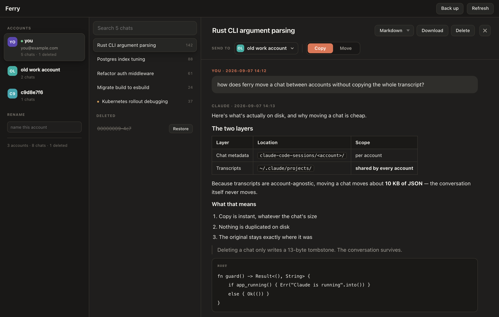

<div align="center">


# Ferry

**Move, copy and back up your Claude Code chats across multiple local accounts.**

A 4 MB native Mac app (and a zero-dependency CLI) for the chat history Claude Code keeps on your machine.

[](LICENSE)




</div>

---

## The problem

You sign into Claude Code with a second account — a work one, a new subscription, a client's — and your chat history is gone. Not deleted, just invisible: Claude Code keeps chat metadata **per account**, so every conversation you had is still on the disk, attached to an account you're no longer signed into.

So you start over and re-explain everything to the model.

Two things make it worse:

- **Transcripts expire.** Claude Code prunes old transcript files. Chats can outlive their own content — the title is listed, the conversation is gone.
- **Deletes can come back.** The desktop app reconciles its own state. A chat you restore by hand can be removed again later.

Ferry fixes both. It reads the files Claude Code already writes, lets you carry a chat from one account to another, and keeps an archive the app can't touch.

## What it does

| | |
|---|---|
| **See every account** | every Claude account you've signed into on this Mac, with its chats — even ones you're signed out of |
| **Identify them** | email for the account you're signed into; connectors, date range and project folders for the rest. Nickname any account and it sticks |
| **Read any chat** | full conversation with proper Markdown — tables, code blocks, lists, quotes — plus tool calls |
| **Copy or move** | drag a chat onto another account, or use the Copy / Move buttons |
| **Download** | save a whole conversation as Markdown, plain text or JSON, anywhere you choose |
| **Delete and undelete** | deletes are reversible; restore from another account or from the archive |
| **Back up** | one button archives every chat and every transcript, subagent transcripts included |

## Why moving a chat is instant

Claude Code stores your history in two separate layers:

| Layer | Location | Scope |
|---|---|---|
| Chat metadata — title, model, folder, timestamps | `~/Library/Application Support/Claude/claude-code-sessions/<account>/<org>/local_<id>.json` | **per account** |
| Deletion marker | same folder, `deleted_<id>` — a millisecond timestamp | per account |
| Transcripts — the actual conversation | `~/.claude/projects/<encoded-cwd>/<sessionId>.jsonl` | **shared by every account** |
| Subagent transcripts | `~/.claude/projects/<encoded-cwd>/<sessionId>/subagents/*.jsonl` | shared |

Because transcripts are account-agnostic, moving a chat only moves about **10 KB of JSON**. A 45 MB conversation transfers in the same instant as a 40 KB one, and nothing is duplicated on disk.

## Install

### Download the app

Grab `Ferry-<version>-macos-universal.zip` from
[Releases](https://github.com/ahkamboh/ferry/releases), unzip it, and drag `Ferry.app`
to your Applications folder. Universal binary — Apple Silicon and Intel.

**First launch:** the app is ad-hoc signed, not notarised, so macOS will refuse a plain
double-click. **Right-click the app → Open → Open.** You only do this once. If macOS still
blocks it:

```bash
xattr -dr com.apple.quarantine /Applications/Ferry.app
```

### Or build it yourself

Requires macOS 11+ and [Rust](https://rustup.rs).

```bash
git clone https://github.com/ahkamboh/ferry.git
cd ferry
./build.sh
open ~/Applications/Ferry.app
```

`build.sh` compiles the Rust binary, bundles `Ferry.app`, and installs it to `~/Applications`.

## CLI

`ferry-cli.py` uses only the Python 3 standard library — no `pip install`, no virtualenv.

```bash
python3 ferry-cli.py list                     # every account and its chats
python3 ferry-cli.py vault                    # archive everything to ~/.ferry
python3 ferry-cli.py export "auth refactor"   # save a chat, Markdown by default
python3 ferry-cli.py export "auth refactor" json
python3 ferry-cli.py export 1191f0ec txt      # disambiguate by session id
python3 ferry-cli.py ui                       # serve the app UI at localhost:7777
```

`export` matches on chat title or session id. If a title matches more than one chat it lists
the candidates with their ids instead of guessing. Files go to the folder you last downloaded
to, `~/Downloads` until you pick another.

`ui` serves the **same interface as the desktop app** — the app's `dist/index.html` with a shim
that turns its `invoke()` calls into HTTP. Markdown rendering, drag-and-drop and the archive all
work there; the only difference is the browser can't open a native save panel, so downloads go
straight to your chosen folder.

Run `vault` from a launchd job or cron and your history is backed up nightly without opening anything.

## The archive

`Back up` copies every chat record and every transcript into `~/.ferry`.

```
~/.ferry/
  chats/<timestamp>/<account>/   chat records, one snapshot per run
  projects/                      every transcript, subagents included
  snapshots/                     an automatic copy before each change
  labels.json                    your account nicknames
  prefs.json                     last folder you downloaded to
```

The archive is yours, outside anything Claude Code manages. Once a chat is in it, deletion becomes cosmetic — restore it into whichever account you want.

## Safety

- **Writes are refused while the Claude app is running.** Quit Claude first; the title bar tells you when editing is off.
- **Every change is snapshotted** into `~/.ferry/snapshots/` before it happens.
- **Transcripts are never moved or edited.** Only the small metadata record moves.
- **Connector settings are stripped on copy.** MCP connector IDs belong to the account that created them and don't resolve elsewhere.
- **Deleting writes a tombstone**, the same marker Claude Code uses. The conversation stays on disk.

## FAQ

**Where does Claude Code store chat history on macOS?**
Two places. Metadata per account in `~/Library/Application Support/Claude/claude-code-sessions/`, and the conversations themselves as JSONL in `~/.claude/projects/`.

**I switched Claude accounts and my chats disappeared. Are they gone?**
No. The transcripts are still on disk — only the per-account metadata changed. Ferry lists every account it finds and can copy a chat into the one you're using now.

**Can I recover a deleted Claude Code chat?**
Usually. Deletion writes a small tombstone rather than erasing the conversation, so if the transcript hasn't been pruned, Ferry can restore it from another account or from `~/.ferry`.

**Why does a chat show a warning dot?**
Its transcript was pruned by Claude Code's cleanup. The record survives, the conversation doesn't. Backing up prevents this.

**Does this send anything anywhere?**
No. Ferry has no network code. It reads and writes local files only.

**Does it work on Windows or Linux?**
Not yet — the paths and the bundle are macOS-specific. The layout is the same idea elsewhere, so a port is mostly path handling.

**Is it affiliated with Anthropic?**
No. Ferry is an independent tool that reads local files written by Claude Code.

## How it's built

Rust + [Tauri 2](https://tauri.app) with a plain HTML/CSS/JS front end — no framework, no npm, no build step for the UI. The Markdown renderer is about 60 lines, written for this app, so nothing is fetched at runtime.

## Contributing

Issues and pull requests welcome. If you hit a layout Ferry doesn't understand — a different Claude Code version, an org setup it misreads — open an issue with the shape of your `claude-code-sessions` folder (no file contents needed).

## Licence

[MIT](LICENSE) © Ali Hamza Kamboh
